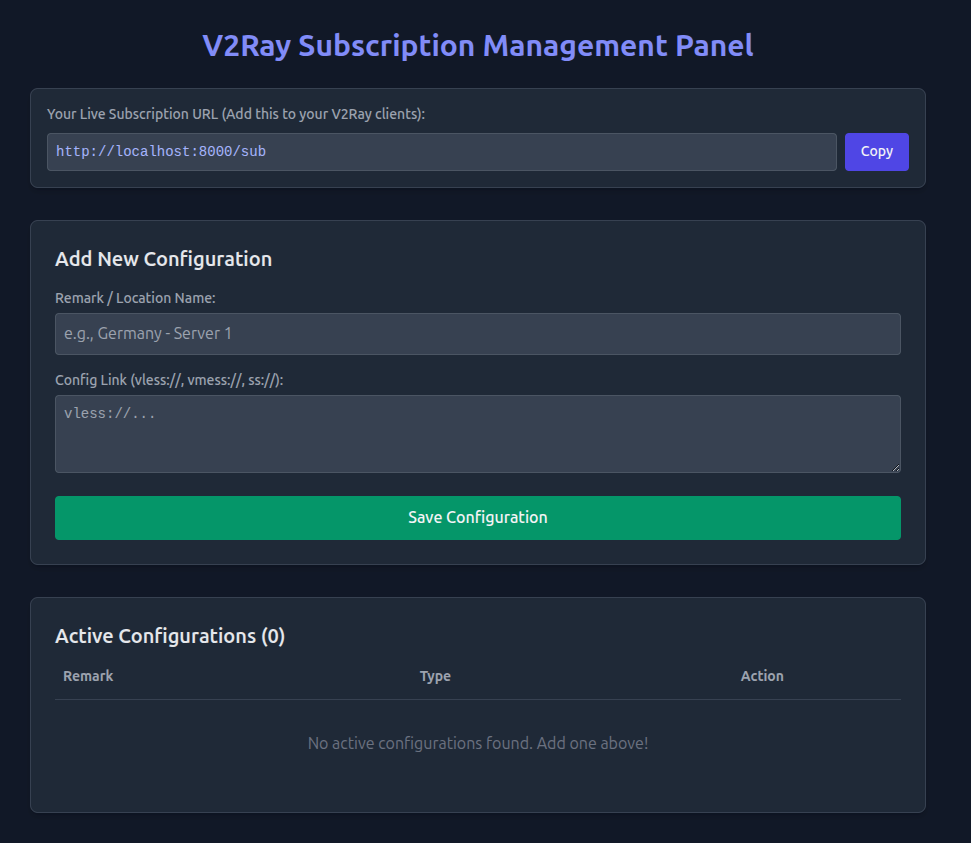

# V2Ray Subscription Management Panel

A FastAPI-based web dashboard for managing V2Ray-compatible subscription configurations. It supports adding, editing, grouping, enabling/disabling, exporting, QR generation, database backup/restore, latency checks, and group-based subscription links.

## Screenshot



---

## Features

### Dashboard

- Modern responsive web UI
- HTTP Basic Authentication for dashboard operations
- Dark glass-style interface
- Statistics cards:
  - Total configurations
  - Active configurations
  - Inactive configurations
  - Groups
- Search and filter configurations by:
  - Panel remark
  - Group
  - Protocol
  - Config link
  - Status

### Configuration Management

- Add one or multiple configs at once
- Edit panel remark
- Edit internal config remark, the part after `#`
- Remove internal config remark by leaving it empty
- Edit the full config link
- Enable or disable individual configs
- Delete individual configs
- Copy individual configs
- Generate QR code for every config
- Detect protocol label in the UI:
  - VLESS
  - VMESS
  - Shadowsocks
  - SSR
  - Trojan

### Groups

- Assign every config to a group
- Edit group per config
- Move selected configs to another group in bulk
- Automatically generate a separate subscription URL per group
- Generate QR code for every group subscription

### Subscription Output

- Global subscription endpoint: `/sub`
- Group subscription endpoint: `/sub/group/{group_name}`
- Only active configs are included in subscription output
- Output is Base64-encoded plain text, compatible with common V2Ray clients

### Bulk Actions

Select multiple configs and run:

- Enable selected configs
- Disable selected configs
- Delete selected configs
- Move selected configs to another group
- Replace host/IP for selected configs

### Bulk Host/IP Replacement

The panel can replace the server host/IP for selected configs.

Supported protocols:

- `vless://`
- `trojan://`
- `ss://`
- `vmess://`
- `ssr://`

Notes:

- For `vmess://`, the `add` field inside the decoded JSON payload is updated.
- For `ssr://`, the decoded host part is updated and the payload is encoded again.
- For URL-based configs, the URL host is replaced while keeping user info, port, query, and fragment.

### Latency Check

- Check latency for a single config
- Check latency for all configs
- Stores:
  - Last check status
  - Last latency in milliseconds
  - Last checked timestamp

Status values:

- `Online`
- `Offline`
- `Invalid host/port`

The latency checker performs a TCP connection test to the parsed `host:port`. It is not a full V2Ray protocol handshake, but it is useful for checking basic reachability.

### Backup and Restore

- Download SQLite database backup from the panel
- Restore a `.db` backup file from the panel
- Before restoring, the app automatically creates a pre-restore backup
- Backup files are stored under `data/backups`

### QR Codes

- QR code for the global subscription URL
- QR code for every group subscription URL
- QR code for every individual config

---

## Supported Protocols

| Protocol | Prefix |
|---|---|
| VLESS | `vless://` |
| VMESS | `vmess://` |
| Shadowsocks | `ss://` |
| ShadowsocksR | `ssr://` |
| Trojan | `trojan://` |

---

## Quick Start

### Using Docker Compose

```bash
docker-compose up -d --build
```

Open the dashboard:

```text
http://localhost:8000
```

Default credentials:

- Username: `admin`
- Password: `admin123`

> Change the default credentials before production use.

### Local Development

```bash
pip install -r requirements.txt

export ADMIN_USERNAME=admin
export ADMIN_PASSWORD=admin123

uvicorn main:app --reload
```

Open:

```text
http://localhost:8000
```

---

## Environment Variables

| Variable | Default | Description |
|---|---:|---|
| `ADMIN_USERNAME` | `admin` | Dashboard username |
| `ADMIN_PASSWORD` | `admin123` | Dashboard password |
| `PYTHONUNBUFFERED` | `1` in Docker Compose | Enables unbuffered Python output |

---

## Docker Compose

The included `docker-compose.yml` exposes the app on port `8000` and persists the SQLite database in `./data`:

```yaml
services:
  v2ray-sub:
    build: .
    container_name: v2ray_sub_panel
    ports:
      - "8000:8000"
    volumes:
      - ./data:/app/data
    environment:
      - PYTHONUNBUFFERED=1
      - ADMIN_USERNAME=admin
      - ADMIN_PASSWORD=admin123
    restart: always
```

---

## Data Storage

The app stores data in SQLite:

```text
data/configs.db
```

Backups are stored in:

```text
data/backups/
```

The Docker Compose volume maps `./data` to `/app/data`, so configs and backups survive container rebuilds.

---

## Main Routes

### Dashboard

```http
GET /
```

Protected by HTTP Basic Authentication.

### Add Configurations

```http
POST /add
```

Form fields:

| Field | Required | Description |
|---|---|---|
| `remark` | Yes | Panel remark / display name |
| `group_name` | No | Group name, defaults to `Default` |
| `config_link` | Yes | One config or multiple configs separated by new lines |

### Edit Configuration

```http
POST /edit/{config_id}
```

Form fields:

| Field | Required | Description |
|---|---|---|
| `remark` | Yes | Panel remark |
| `group_name` | No | Config group |
| `config_remark` | No | Internal config remark after `#`; leave empty to remove it |
| `config_link` | Yes | Full config link |

### Toggle Configuration

```http
GET /toggle/{config_id}
```

Enables an inactive config or disables an active config.

### Delete Configuration

```http
GET /delete/{config_id}
```

Deletes one config.

### Bulk Actions

```http
POST /bulk
```

Form fields:

| Field | Description |
|---|---|
| `selected_ids` | One or more selected config IDs |
| `action` | `enable`, `disable`, `delete`, `move`, or `replace_host` |
| `bulk_group_name` | Used as target group for `move`, or new host/IP for `replace_host` |

### Global Subscription

```http
GET /sub
```

Returns all active configs as a Base64-encoded subscription.

### Group Subscription

```http
GET /sub/group/{group_name}
```

Returns active configs only from the selected group.

### QR Codes

```http
GET /qr/sub
GET /qr/sub/group/{group_name}
GET /qr/config/{config_id}
```

### Latency Checks

```http
GET /check/{config_id}
GET /check-all
```

### Backup and Restore

```http
GET /backup
POST /restore
```

`POST /restore` accepts a `.db` file using multipart form field:

```text
backup_file
```

---

## Subscription Behavior

Only active configs are included in subscription endpoints.

The response format is:

1. Join configs with newline separators
2. Encode the result using Base64
3. Return it as `text/plain`

Example decoded output:

```text
vless://uuid@example.com:443?security=tls#Germany
vmess://base64payload#US
ss://method:password@example.com:8388#Singapore
```

---

## Security Notes

- Dashboard operations require HTTP Basic Authentication.
- `/sub` and `/sub/group/{group_name}` are public by design for V2Ray clients.
- Subscription output is Base64-encoded, not encrypted.
- Use HTTPS in production.
- Change the default `admin/admin123` credentials.
- Protect the dashboard behind a reverse proxy or firewall if needed.

---

## Production Recommendations

- Run behind Nginx, Caddy, or another reverse proxy
- Enable HTTPS
- Change default credentials
- Keep `./data` backed up
- Use the built-in backup feature before major edits
- Rebuild the Docker image after dependency changes:

```bash
docker-compose up -d --build
```

---

## Troubleshooting

### Empty subscription output

Possible causes:

- No configs have been added
- All configs are inactive
- You are using a group subscription for an empty group

### QR code does not load

Make sure the Docker image was rebuilt after adding the `qrcode[pil]` dependency:

```bash
docker-compose up -d --build
```

### Latency shows `Invalid host/port`

The app could not parse a usable host and port from the config link.

### Latency shows `Offline`

The TCP connection to the parsed host and port failed or timed out.

### Restore failed

Possible causes:

- Uploaded file is not a `.db` file
- Uploaded file is not a valid SQLite database
- Container does not have write access to `data/configs.db`
